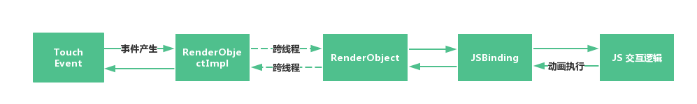
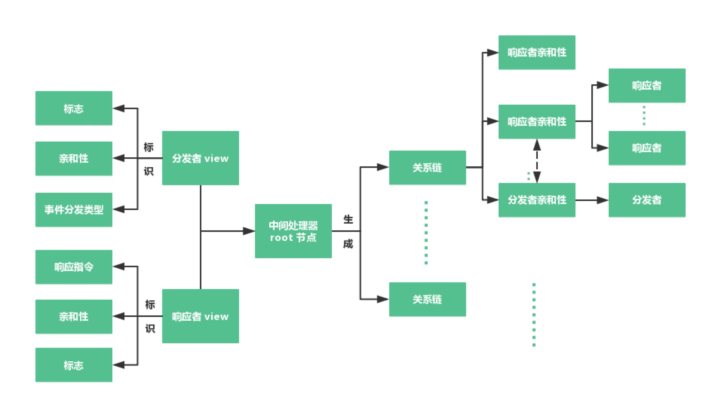

### Coordinator Animation

对于 RN 这类跨平台框架而言，它们提高了开发效率和迭代速度，但是由于依赖于 JavaScript 语言带来了在交互上响应迟钝的问题，使得他们所使用的场景有所局限。当然也有许多的想法去解决这样的问题，但是依然不能去媲美 Native 的开发方式和效率。

而对于 Lynx 而言，它具备了上述跨平台框架的优点外，还具备突出的优点是，在交互上有了极大的突破，具有和 Native 相当的交互性能。下面就来分析一下 Lynx 的从遇到问题到解决问题的思路和设计。

#### 问题探究

**问题**：依赖于 JavaScript 引擎的跨平台开发框架交互性能差，例如上面的 gif 中的跟手动画的效果，如果在 js 逻辑上不断的去改变每一个控件的位置和大小，会出现严重掉帧不跟手的效果。

**流程分析：**

Touch 事件产生后，会经过 RenderObjectImpl 交给事件收集器，等待 JS 线程调度，然后来到 RenderObject 通过 JSBinding 触发 JS 的产生动画执行的结果，然后再经过同样的链路回到上层的 RenderObjectImpl 触发 View 的动画，或者通过影响 RenderObject 的排版结果产生变化效果。

**原因分析：**

1. js 即使经过 JIT 之后执行速度相对于 native 执行还是比较慢。
2. js 引擎的 Extension 方式有一定的消耗。
3. 跨线程通信带来的消耗。

**解决思路：**

js 线程的出现就是避免不阻塞 ui 线程，因此跨现场和 js 执行速度是一个绕不过的问题。Lynx 通过利用自研的小型类 js 虚拟机 lepus 及定义一套协作关系链，在主线程执行脚本里的相关动画逻辑，避开 js 执行速度慢的问题，从而在不改变原有的写法上很好的解决了交互性能问题。总结：

1. 在 ui 线程上执行 js 相似写法的动画脚本（利用自研小型虚拟机 lepus）。
2. 定义一套协作框架（关系链），在动画脚本上据此控制链路上 view 的动画效果。

#### 设计

一些基础的概念如分发者，响应者，以及一些基础的用法可以参考[这篇 交互动画 介绍](https://hxxft.github.io/lynx-book/animation/interactive-animation.html)。

> 这里主要介绍协作框架及整体流程，不涉及 lepus 脚本引擎的内部实现细节

**协作者框架**：定义了一套 view 之间的关系链（在js 层面的表现为 Element 的关系链），决定了事件在父亲区域产生并响应后，事件分发如何从父亲如何流向孩子，同时提供了自身和孩子的对于事件处理的动画表现时机。这一套协作关系不仅提供了简明扼要的方式链接动画脚本和一系列 view，同时简化了原本需要复杂实现的联动动画效果，如上所示的 gif 图。

**总体设计图**

整体的链路均是在 ui 线程完成，且每次的操作耗时小于 1ms 。

分发者：接受事件或者产生事件的 view / LynxUI，如 touch 事件，scroll 事件。相关类是 CrdSponsor，所有 LynxUI 均实现了接口 CrdSponsor 。

响应者：根据来自分发者的事件作出相关响应并根据脚本的结果实现动画的 view / LynxUI。相关类 CrdResponder ，所有的 LynxUI 均实现了接口 CrdResponder。

中间处理器：整个协作框架的核心，它主要负责几件事情，根据分发者提供的脚本初始化脚本引擎；根据分发者和响应者的亲和性，建立它们的关系链；在响应时间的过程中，它会先进行提前处理，询问分发者自身的是否响应事件（onDispatch 操作），接着会根据关系链查找分发者对应可以分发的响应者数组，然后一一询问响应者将要做出的回应。相关的类是 TransferStation。

代理：响应者和分发者的响应代理类，里面预设了固定的函数指令用于与底层脚本引擎通信。其中涉及了 PreTreatment 和 Treatment 类。

脚本引擎：根据指令执行动画脚本中对应的分发者和响应者的操作，把结果生成 action 交给动画执行器。其中涉及 CoordinatorExecutor 和 CoordinatorAction 类。

动画执行器：根据脚本引擎生成的 action，对 view 进行相关动画调用，如 tranlate 等。其中涉及 CrdActionExecutor 类。

**分发者和响应者关系**

分发者和响应者关系的正确建立是整个交互动画框架的基础。关系的定义主要是通过亲和性 affinity 决定的，定义关系通过 `CoordinatorRegister.registerAction() ` 方法确定关系链，即一个分发者和一组响应者的对应关系或者一个分发者与多组响应者的对应关系。

#### 缺点

不支持交互时实时更改排版的功能，也就是无法根据排版的变化影响孩子的位置。这个原因主要是在 Lynx 框架中排版这一步骤本是在 js 线程执行，是一个比较重的操作，同时对于前端来说是一个同步获取排版结果的功能（与其他跨平台框架不同的地方），所以暂时不考虑在 ui 线程的交互动画上支持排版变化引起的动画。

#### 后续

提供更丰富的连续的动画效果支持，例如交互结束后仍然执行的多段动画。

